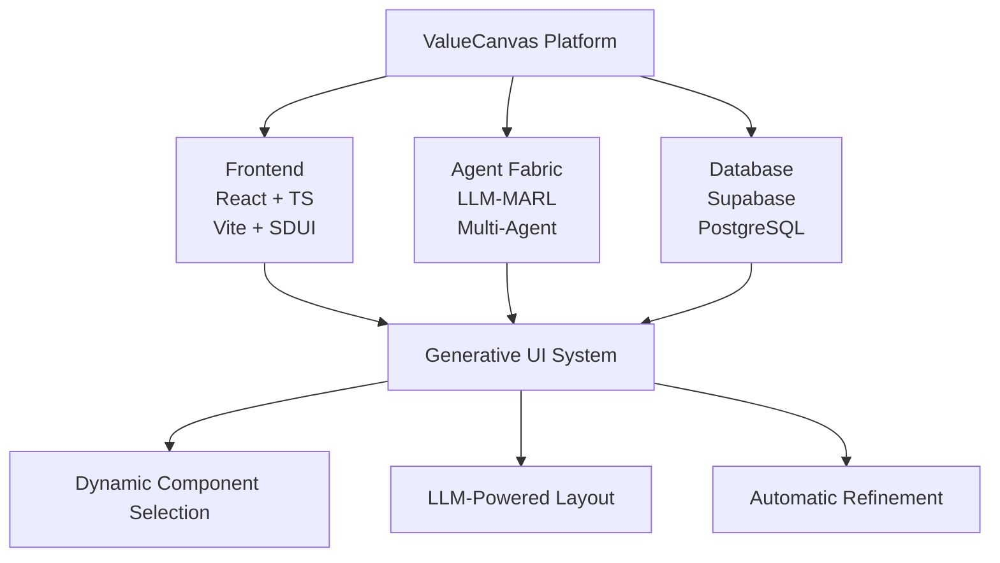
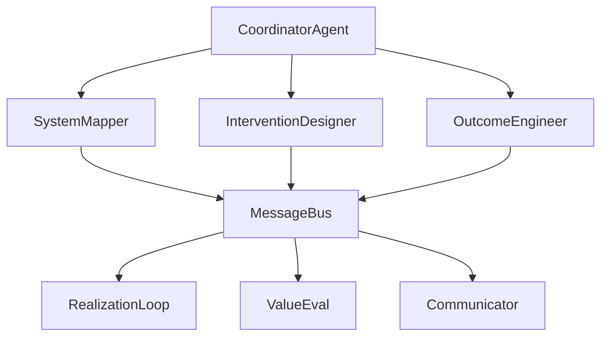

# Architecture Diagrams

**Date:** November 22, 2024  
**Purpose:** Visual representation of ValueCanvas architecture  
**Status:** ASCII diagrams (can be converted to Mermaid/PlantUML)

---

## System Overview

```
┌─────────────────────────────────────────────────────────────────┐
│                      ValueCanvas Platform                        │
├─────────────────────────────────────────────────────────────────┤
│                                                                   │
│  ┌──────────────┐  ┌──────────────┐  ┌──────────────┐          │
│  │   Frontend   │  │  Agent Fabric │  │   Database   │          │
│  │  React + TS  │◄─┤  LLM-MARL    │◄─┤  Supabase    │          │
│  │  Vite + SDUI │  │  Multi-Agent │  │  PostgreSQL  │          │
│  └──────────────┘  └──────────────┘  └──────────────┘          │
│         │                  │                  │                  │
│         ▼                  ▼                  ▼                  │
│  ┌──────────────────────────────────────────────────┐          │
│  │           Generative UI System (SDUI)             │          │
│  │  - Dynamic Component Selection                    │          │
│  │  - LLM-Powered Layout Generation                  │          │
│  │  - Automatic Refinement Loop                      │          │
│  └──────────────────────────────────────────────────┘          │
│                                                                   │
└─────────────────────────────────────────────────────────────────┘
```

---

## LLM-MARL Agent System

```
┌─────────────────────────────────────────────────────────────────┐
│                    CoordinatorAgent (Master)                     │
│  - Task Planning & Decomposition                                 │
│  - Agent Routing & Orchestration                                 │
│  - SDUI Layout Generation                                        │
└────────────────────────┬────────────────────────────────────────┘
                         │
         ┌───────────────┼───────────────┐
         │               │               │
         ▼               ▼               ▼
┌─────────────┐  ┌─────────────┐  ┌─────────────┐
│   System    │  │Intervention │  │  Outcome    │
│   Mapper    │  │  Designer   │  │  Engineer   │
│   Agent     │  │   Agent     │  │   Agent     │
└─────────────┘  └─────────────┘  └─────────────┘
         │               │               │
         └───────────────┼───────────────┘
                         │
                         ▼
              ┌─────────────────┐
              │   MessageBus    │
              │  (Event-Driven) │
              └─────────────────┘
                         │
         ┌───────────────┼───────────────┐
         │               │               │
         ▼               ▼               ▼
┌─────────────┐  ┌─────────────┐  ┌─────────────┐
│Realization  │  │    Value    │  │Communicator │
│    Loop     │  │    Eval     │  │   Agent     │
│   Agent     │  │   Agent     │  │             │
└─────────────┘  └─────────────┘  └─────────────┘
```

---

## Generative UI Flow

```
┌─────────────────────────────────────────────────────────────────┐
│                        User Intent                               │
└────────────────────────┬────────────────────────────────────────┘
                         │
                         ▼
              ┌─────────────────┐
              │ CoordinatorAgent│
              │  - Parse Intent │
              │  - Create Plan  │
              └────────┬────────┘
                       │
                       ▼
              ┌─────────────────┐
              │  LLM Gateway    │
              │  - Together.ai  │
              │  - OpenAI       │
              └────────┬────────┘
                       │
                       ▼
        ┌──────────────────────────────┐
        │  Component Selection         │
        │  - Analyze Subgoal           │
        │  - Search Registry           │
        │  - Select Best Components    │
        └──────────────┬───────────────┘
                       │
                       ▼
        ┌──────────────────────────────┐
        │  Layout Generation           │
        │  - Create Page Structure     │
        │  - Arrange Components        │
        │  - Add Data Bindings         │
        └──────────────┬───────────────┘
                       │
                       ▼
        ┌──────────────────────────────┐
        │  Refinement Loop (3x)        │
        │  - Evaluate Quality          │
        │  - Generate Improvements     │
        │  - Apply Refinements         │
        └──────────────┬───────────────┘
                       │
                       ▼
              ┌─────────────────┐
              │  SDUI Renderer  │
              │  - Hydrate Data │
              │  - Render UI    │
              └────────┬────────┘
                       │
                       ▼
        ┌──────────────────────────────┐
        │     User Interface           │
        └──────────────────────────────┘
```

---

## Database Schema Overview

```
┌─────────────────────────────────────────────────────────────────┐
│                      Supabase PostgreSQL                         │
├─────────────────────────────────────────────────────────────────┤
│                                                                   │
│  ┌──────────────────┐  ┌──────────────────┐                    │
│  │  Agent Fabric    │  │  Episodic Memory │                    │
│  │  - Sessions      │  │  - Interactions  │                    │
│  │  - Metrics       │  │  - Feedback      │                    │
│  │  - Events        │  │  - Learning      │                    │
│  └──────────────────┘  └──────────────────┘                    │
│                                                                   │
│  ┌──────────────────┐  ┌──────────────────┐                    │
│  │  Workflow        │  │  SOF Framework   │                    │
│  │  - Executions    │  │  - System Maps   │                    │
│  │  - Tasks         │  │  - Interventions │                    │
│  │  - Logs          │  │  - Feedback      │                    │
│  └──────────────────┘  └──────────────────┘                    │
│                                                                   │
│  ┌──────────────────┐  ┌──────────────────┐                    │
│  │  UI Generation   │  │  Artifact Scores │                    │
│  │  - Attempts      │  │  - Evaluations   │                    │
│  │  - Refinements   │  │  - History       │                    │
│  │  - Metrics       │  │  - Improvements  │                    │
│  └──────────────────┘  └──────────────────┘                    │
│                                                                   │
└─────────────────────────────────────────────────────────────────┘
```

---

## Request Flow

```
┌─────────┐
│  User   │
└────┬────┘
     │ 1. User Action
     ▼
┌─────────────┐
│   React     │
│   Frontend  │
└────┬────────┘
     │ 2. API Call
     ▼
┌─────────────┐
│  Supabase   │
│   Client    │
└────┬────────┘
     │ 3. Query/Mutation
     ▼
┌─────────────┐
│  PostgreSQL │
│   Database  │
└────┬────────┘
     │ 4. Data
     ▼
┌─────────────┐
│   Agent     │
│   Fabric    │
└────┬────────┘
     │ 5. Process
     ▼
┌─────────────┐
│     LLM     │
│   Gateway   │
└────┬────────┘
     │ 6. Generate
     ▼
┌─────────────┐
│    SDUI     │
│  Renderer   │
└────┬────────┘
     │ 7. Render
     ▼
┌─────────┐
│  User   │
└─────────┘
```

---

## SOF Framework Flow

```
┌─────────────────────────────────────────────────────────────────┐
│                    Systemic Outcome Framework                    │
├─────────────────────────────────────────────────────────────────┤
│                                                                   │
│  1. DISCOVERY                                                    │
│  ┌──────────────────────────────────────────────────┐          │
│  │  SystemMapperAgent                                │          │
│  │  - Map system entities & relationships            │          │
│  │  - Identify feedback loops                        │          │
│  │  - Analyze system dynamics                        │          │
│  └────────────────────┬─────────────────────────────┘          │
│                       │                                          │
│  2. INTERVENTION                                                 │
│  ┌────────────────────▼─────────────────────────────┐          │
│  │  InterventionDesignerAgent                        │          │
│  │  - Identify intervention points                   │          │
│  │  - Design interventions                           │          │
│  │  - Assess leverage & risk                         │          │
│  └────────────────────┬─────────────────────────────┘          │
│                       │                                          │
│  3. OUTCOME                                                      │
│  ┌────────────────────▼─────────────────────────────┐          │
│  │  OutcomeEngineerAgent                             │          │
│  │  - Define desired outcomes                        │          │
│  │  - Create measurement framework                   │          │
│  │  - Design feedback mechanisms                     │          │
│  └────────────────────┬─────────────────────────────┘          │
│                       │                                          │
│  4. REALIZATION                                                  │
│  ┌────────────────────▼─────────────────────────────┐          │
│  │  RealizationLoopAgent                             │          │
│  │  - Track implementation                           │          │
│  │  - Measure outcomes                               │          │
│  │  - Adjust interventions                           │          │
│  └────────────────────┬─────────────────────────────┘          │
│                       │                                          │
│  5. EVALUATION                                                   │
│  ┌────────────────────▼─────────────────────────────┐          │
│  │  ValueEvalAgent                                   │          │
│  │  - Score artifact quality                         │          │
│  │  - Generate improvements                          │          │
│  │  - Provide feedback                               │          │
│  └──────────────────────────────────────────────────┘          │
│                                                                   │
└─────────────────────────────────────────────────────────────────┘
```

---

## Deployment Architecture

```
┌─────────────────────────────────────────────────────────────────┐
│                         Production                               │
├─────────────────────────────────────────────────────────────────┤
│                                                                   │
│  ┌──────────────┐  ┌──────────────┐  ┌──────────────┐          │
│  │    Vercel    │  │   Supabase   │  │    Sentry    │          │
│  │   Frontend   │  │   Backend    │  │  Monitoring  │          │
│  │   Hosting    │  │   Database   │  │    Errors    │          │
│  └──────┬───────┘  └──────┬───────┘  └──────┬───────┘          │
│         │                  │                  │                  │
│         └──────────────────┼──────────────────┘                  │
│                            │                                      │
│                            ▼                                      │
│                   ┌─────────────────┐                           │
│                   │   CDN (Global)  │                           │
│                   │  - Static Assets│                           │
│                   │  - Edge Caching │                           │
│                   └─────────────────┘                           │
│                                                                   │
│  ┌──────────────────────────────────────────────────┐          │
│  │              Load Balancer                        │          │
│  └──────────────────────────────────────────────────┘          │
│                            │                                      │
│         ┌──────────────────┼──────────────────┐                 │
│         │                  │                  │                  │
│         ▼                  ▼                  ▼                  │
│  ┌──────────┐      ┌──────────┐      ┌──────────┐             │
│  │  Region  │      │  Region  │      │  Region  │             │
│  │   US-E   │      │   EU-W   │      │  AP-SE   │             │
│  └──────────┘      └──────────┘      └──────────┘             │
│                                                                   │
└─────────────────────────────────────────────────────────────────┘
```

---

## Security Architecture

```
┌─────────────────────────────────────────────────────────────────┐
│                      Security Layers                             │
├─────────────────────────────────────────────────────────────────┤
│                                                                   │
│  Layer 1: Network Security                                       │
│  ┌──────────────────────────────────────────────────┐          │
│  │  - HTTPS/TLS 1.3                                 │          │
│  │  - WAF (Web Application Firewall)                │          │
│  │  - DDoS Protection                                │          │
│  │  - Rate Limiting                                  │          │
│  └──────────────────────────────────────────────────┘          │
│                                                                   │
│  Layer 2: Application Security                                   │
│  ┌──────────────────────────────────────────────────┐          │
│  │  - CSP (Content Security Policy)                 │          │
│  │  - CSRF Protection                                │          │
│  │  - Input Sanitization (DOMPurify)                │          │
│  │  - XSS Prevention                                 │          │
│  └──────────────────────────────────────────────────┘          │
│                                                                   │
│  Layer 3: Authentication & Authorization                         │
│  ┌──────────────────────────────────────────────────┐          │
│  │  - Supabase Auth (JWT)                           │          │
│  │  - Row Level Security (RLS)                      │          │
│  │  - Role-Based Access Control (RBAC)              │          │
│  │  - MFA Support                                    │          │
│  └──────────────────────────────────────────────────┘          │
│                                                                   │
│  Layer 4: Data Security                                          │
│  ┌──────────────────────────────────────────────────┐          │
│  │  - Encryption at Rest (AES-256)                  │          │
│  │  - Encryption in Transit (TLS)                   │          │
│  │  - Secure Password Hashing (bcrypt)              │          │
│  │  - Audit Logging                                  │          │
│  └──────────────────────────────────────────────────┘          │
│                                                                   │
└─────────────────────────────────────────────────────────────────┘
```

---

## Monitoring & Observability

```
┌─────────────────────────────────────────────────────────────────┐
│                    Monitoring Stack                              │
├─────────────────────────────────────────────────────────────────┤
│                                                                   │
│  ┌──────────────┐  ┌──────────────┐  ┌──────────────┐          │
│  │    Sentry    │  │   Datadog    │  │ Prometheus   │          │
│  │  Error Track │  │   APM        │  │   Metrics    │          │
│  └──────┬───────┘  └──────┬───────┘  └──────┬───────┘          │
│         │                  │                  │                  │
│         └──────────────────┼──────────────────┘                  │
│                            │                                      │
│                            ▼                                      │
│                   ┌─────────────────┐                           │
│                   │  Grafana        │                           │
│                   │  Dashboards     │                           │
│                   └─────────────────┘                           │
│                            │                                      │
│                            ▼                                      │
│                   ┌─────────────────┐                           │
│                   │  Alert Manager  │                           │
│                   │  - PagerDuty    │                           │
│                   │  - Slack        │                           │
│                   └─────────────────┘                           │
│                                                                   │
└─────────────────────────────────────────────────────────────────┘
```

---

## Converting to Mermaid

To convert these ASCII diagrams to Mermaid (for GitHub/GitLab rendering):

### Example: System Overview in Mermaid



### Example: Agent System in Mermaid



---

## Tools for Diagram Creation

### Recommended Tools

1. **Mermaid** (Markdown-native)
   - GitHub/GitLab support
   - Live editor: https://mermaid.live
   - Documentation: https://mermaid.js.org

2. **PlantUML** (UML diagrams)
   - Comprehensive UML support
   - Online editor: http://www.plantuml.com
   - VS Code extension available

3. **Draw.io** (Visual editor)
   - Free, web-based
   - Export to PNG/SVG
   - URL: https://app.diagrams.net

4. **Excalidraw** (Hand-drawn style)
   - Beautiful sketchy diagrams
   - URL: https://excalidraw.com
   - Great for architecture diagrams

---

## Next Steps

1. **Choose Tool:** Select Mermaid for GitHub integration
2. **Convert Diagrams:** Convert ASCII to Mermaid syntax
3. **Add to Docs:** Embed in relevant documentation
4. **Update Regularly:** Keep diagrams in sync with code

---

**Created:** November 22, 2024  
**Format:** ASCII (ready for Mermaid conversion)  
**Status:** Ready to use
