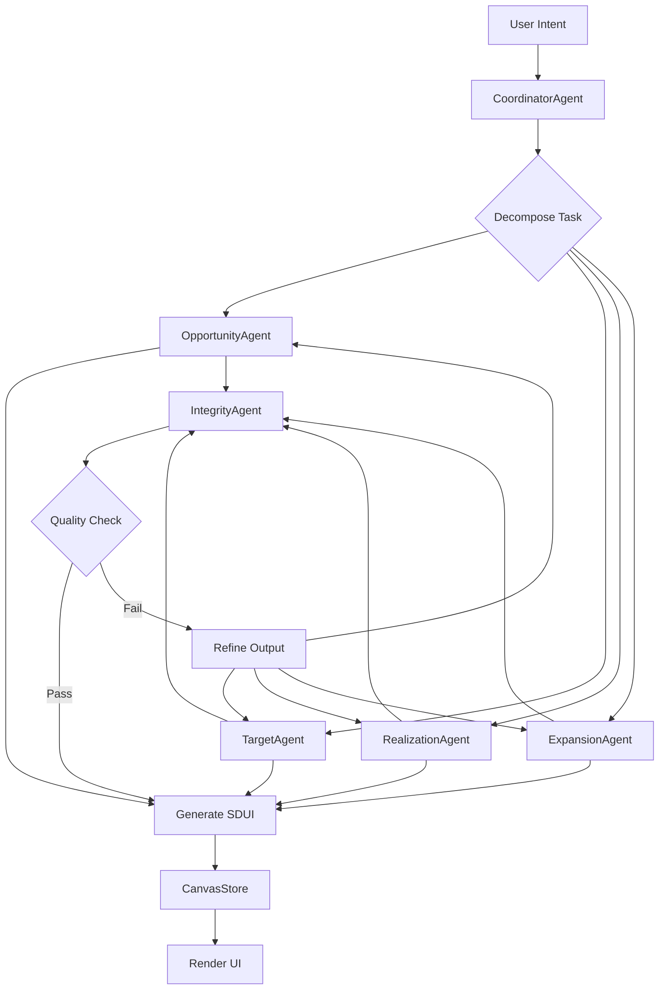

# Architecture Workflows
## EPIC 2: Missing Architecture Workflows

**Last Updated:** December 5, 2025

---

## Overview

This document details the core architectural workflows that power ValueCanvas, including value trees, formula evaluation, orchestrator logs, and data flow patterns.

---

## 1. Value Tree Construction

### Purpose
Build hierarchical value models linking interventions → outcomes → KPIs → business value.

### Workflow

```
┌─────────────────┐
│  User Input     │
│  (Intervention) │
└────────┬────────┘
         │
         ▼
┌─────────────────┐
│ OpportunityAgent│
│ - Builds causal │
│   pathways      │
└────────┬────────┘
         │
         ▼
┌─────────────────┐
│  Value Tree     │
│  Structure      │
│  ┌───────────┐  │
│  │Root: $10M │  │
│  ├─KPI:Sales │  │
│  │ ├─Outcome │  │
│  │ └─Action  │  │
│  └─KPI:Churn │  │
│    ├─Outcome │  │
│    └─Action  │  │
└─────────────────┘
```

### Data Structure

```typescript
interface ValueTree {
  root: ValueNode;
  metadata: {
    organizationId: string;
    createdAt: string;
    lastUpdated: string;
  };
}

interface ValueNode {
  id: string;
  type: 'root' | 'kpi' | 'outcome' | 'action';
  label: string;
  value?: number;
  unit?: string;
  children: ValueNode[];
  formula?: Formula;
  metadata: Record<string, any>;
}
```

### Implementation

**Service:** `/src/services/ValueTreeService.ts`

```typescript
class ValueTreeService {
  /**
   * Build value tree from opportunity analysis
   */
  async buildTree(
    opportunityOutput: OpportunityOutput,
    kpis: KPI[]
  ): Promise<ValueTree> {
    const root = this.createRootNode(kpis);
    
    for (const hypothesis of opportunityOutput.outcomeHypotheses) {
      const kpiNode = this.findOrCreateKPINode(root, hypothesis.targetKPI);
      const outcomeNode = this.createOutcomeNode(hypothesis);
      kpiNode.children.push(outcomeNode);
      
      // Link interventions as actions
      for (const intervention of hypothesis.interventions) {
        const actionNode = this.createActionNode(intervention);
        outcomeNode.children.push(actionNode);
      }
    }
    
    return { root, metadata: this.buildMetadata() };
  }
  
  /**
   * Calculate aggregate value up the tree
   */
  calculateValue(node: ValueNode): number {
    if (node.value !== undefined) return node.value;
    
    if (node.formula) {
      return this.evaluateFormula(node.formula, node);
    }
    
    // Sum children
    return node.children.reduce((sum, child) => {
      return sum + this.calculateValue(child);
    }, 0);
  }
}
```

---

## 2. Formula Evaluation Engine

### Purpose
Evaluate mathematical expressions for KPI calculations, ROI models, and value aggregation.

### Supported Operations

- **Arithmetic:** `+`, `-`, `*`, `/`, `%`, `^`
- **Comparison:** `>`, `<`, `>=`, `<=`, `==`, `!=`
- **Logical:** `AND`, `OR`, `NOT`
- **Functions:** `SUM`, `AVG`, `MIN`, `MAX`, `IF`, `ROUND`
- **Variables:** `{kpi.current}`, `{kpi.target}`, `{intervention.cost}`

### Formula DSL

```typescript
interface Formula {
  expression: string;
  variables: Record<string, number | string>;
  resultType: 'number' | 'boolean' | 'string';
}

// Example formulas
const roiFormula: Formula = {
  expression: '({revenue.gain} - {implementation.cost}) / {implementation.cost} * 100',
  variables: {
    'revenue.gain': 500000,
    'implementation.cost': 100000
  },
  resultType: 'number'
};

const kpiImpactFormula: Formula = {
  expression: '{kpi.target} - {kpi.current}',
  variables: {
    'kpi.target': 95,
    'kpi.current': 78
  },
  resultType: 'number'
};
```

### Implementation

**Service:** `/src/services/FormulaEngine.ts`

```typescript
class FormulaEngine {
  /**
   * Evaluate formula with variable substitution
   */
  evaluate(formula: Formula): number | boolean | string {
    let expression = formula.expression;
    
    // Substitute variables
    for (const [key, value] of Object.entries(formula.variables)) {
      expression = expression.replace(
        new RegExp(`\\{${key}\\}`, 'g'),
        String(value)
      );
    }
    
    // Parse and evaluate
    return this.parse(expression);
  }
  
  /**
   * Parse expression into AST and evaluate
   */
  private parse(expression: string): any {
    // Tokenize
    const tokens = this.tokenize(expression);
    
    // Build AST
    const ast = this.buildAST(tokens);
    
    // Evaluate
    return this.evaluateAST(ast);
  }
  
  /**
   * Validate formula before execution
   */
  validate(formula: Formula): { valid: boolean; errors: string[] } {
    const errors: string[] = [];
    
    // Check for undefined variables
    const varPattern = /\{([^}]+)\}/g;
    const matches = formula.expression.matchAll(varPattern);
    
    for (const match of matches) {
      const varName = match[1];
      if (!(varName in formula.variables)) {
        errors.push(`Undefined variable: ${varName}`);
      }
    }
    
    // Check for syntax errors
    try {
      this.parse(formula.expression);
    } catch (e) {
      errors.push(`Syntax error: ${e.message}`);
    }
    
    return {
      valid: errors.length === 0,
      errors
    };
  }
}
```

---

## 3. Orchestrator Logging

### Purpose
Comprehensive audit trail of all agent orchestration decisions, task routing, and execution.

### Log Structure

```typescript
interface OrchestratorLog {
  id: string;
  timestamp: string;
  eventType: 
    | 'task_received'
    | 'task_decomposed'
    | 'subgoal_routed'
    | 'agent_invoked'
    | 'agent_completed'
    | 'task_completed'
    | 'error_occurred';
  taskId: string;
  userId: string;
  organizationId: string;
  payload: Record<string, any>;
  metadata: {
    duration?: number;
    success: boolean;
    errorMessage?: string;
  };
}
```

### Logging Workflow

```
User Intent
    ↓
[LOG: task_received]
    ↓
CoordinatorAgent.planTask()
    ↓
[LOG: task_decomposed] 
    {subgoals: [...]}
    ↓
For each subgoal:
    ↓
[LOG: subgoal_routed]
    {subgoalId, assignedAgent}
    ↓
[LOG: agent_invoked]
    {agentId, input}
    ↓
Agent.execute()
    ↓
[LOG: agent_completed]
    {agentId, output, duration}
    ↓
[LOG: task_completed]
    {taskId, totalDuration, success}
```

### Implementation

**Service:** `/src/services/OrchestratorLogger.ts`

```typescript
class OrchestratorLogger {
  /**
   * Log orchestration event
   */
  async log(event: Partial<OrchestratorLog>): Promise<void> {
    const log: OrchestratorLog = {
      id: uuidv4(),
      timestamp: new Date().toISOString(),
      ...event
    } as OrchestratorLog;
    
    // Store in database
    await supabase.from('orchestrator_logs').insert(log);
    
    // Emit to telemetry
    sduiTelemetry.recordEvent({
      type: event.eventType,
      metadata: log.payload
    });
    
    // Debug logging
    logger.debug('Orchestrator event', log);
  }
  
  /**
   * Query logs for analysis
   */
  async query(filters: {
    taskId?: string;
    userId?: string;
    eventType?: string;
    startDate?: Date;
    endDate?: Date;
  }): Promise<OrchestratorLog[]> {
    let query = supabase.from('orchestrator_logs').select('*');
    
    if (filters.taskId) {
      query = query.eq('taskId', filters.taskId);
    }
    
    if (filters.userId) {
      query = query.eq('userId', filters.userId);
    }
    
    if (filters.eventType) {
      query = query.eq('eventType', filters.eventType);
    }
    
    if (filters.startDate) {
      query = query.gte('timestamp', filters.startDate.toISOString());
    }
    
    if (filters.endDate) {
      query = query.lte('timestamp', filters.endDate.toISOString());
    }
    
    const { data, error } = await query.order('timestamp', { ascending: false });
    
    if (error) throw error;
    return data || [];
  }
  
  /**
   * Generate task execution timeline
   */
  async getTaskTimeline(taskId: string): Promise<{
    events: OrchestratorLog[];
    duration: number;
    agentBreakdown: Record<string, number>;
  }> {
    const logs = await this.query({ taskId });
    
    const startEvent = logs.find(l => l.eventType === 'task_received');
    const endEvent = logs.find(l => l.eventType === 'task_completed');
    
    const duration = endEvent && startEvent
      ? new Date(endEvent.timestamp).getTime() - new Date(startEvent.timestamp).getTime()
      : 0;
    
    // Calculate agent-wise duration
    const agentBreakdown: Record<string, number> = {};
    const agentInvocations = logs.filter(l => l.eventType === 'agent_invoked');
    const agentCompletions = logs.filter(l => l.eventType === 'agent_completed');
    
    for (const invocation of agentInvocations) {
      const completion = agentCompletions.find(
        c => c.payload.agentId === invocation.payload.agentId
      );
      
      if (completion && completion.metadata.duration) {
        const agentId = invocation.payload.agentId;
        agentBreakdown[agentId] = (agentBreakdown[agentId] || 0) + completion.metadata.duration;
      }
    }
    
    return { events: logs, duration, agentBreakdown };
  }
}
```

---

## 4. Data Flow Patterns

### Pattern 1: Request-Response (Synchronous)

```
Client
  ↓ (HTTP POST /api/agent/chat)
AgentChatService
  ↓
UnifiedAgentOrchestrator
  ↓
CoordinatorAgent
  ↓ (routes to)
SpecializedAgent (e.g., OpportunityAgent)
  ↓
LLMGateway
  ↓ (API call)
Together.ai
  ↓ (response)
Agent processes output
  ↓
Generate SDUI layout
  ↓
Return to client
```

### Pattern 2: Event-Driven (Realtime)

```
Agent completes task
  ↓
Update Supabase table (value_cases)
  ↓
Supabase Realtime broadcasts change
  ↓
All subscribed clients receive event
  ↓
Client updates CanvasStore
  ↓
React re-renders UI
```

### Pattern 3: Streaming (Incremental Updates)

```
Client initiates streaming request
  ↓
AgentChatService.chatStream()
  ↓
LLM streams tokens
  ↓
For each token/chunk:
  ↓
  Emit SSE event to client
  ↓
  Client updates UI incrementally
  ↓
Final chunk received
  ↓
Generate complete SDUI layout
  ↓
Send final update
```

### Pattern 4: Background Processing (Async)

```
User uploads file
  ↓
Enqueue job (BullMQ/Supabase Edge Function)
  ↓
Return job ID to user
  ↓
Background worker picks up job
  ↓
Process file (extract text, analyze)
  ↓
Store results in Supabase
  ↓
Emit realtime event
  ↓
Client receives completion notification
```

---

## 5. Workflow State Machine

### States

```typescript
type WorkflowState = 
  | 'pending'
  | 'in_progress'
  | 'paused'
  | 'completed'
  | 'failed'
  | 'cancelled';

interface WorkflowStateMachine {
  currentState: WorkflowState;
  currentStage: 'opportunity' | 'target' | 'realization' | 'expansion';
  completedStages: string[];
  context: Record<string, any>;
}
```

### State Transitions

```
pending
  ↓ (user starts task)
in_progress
  ↓ (user pauses)
paused
  ↓ (user resumes)
in_progress
  ↓ (task completes successfully)
completed

in_progress
  ↓ (error occurs)
failed
  ↓ (user retries)
in_progress

any state
  ↓ (user cancels)
cancelled
```

### Implementation

**Service:** `/src/services/WorkflowStateService.ts` (already exists)

Enhanced with:
```typescript
/**
 * Validate state transition
 */
canTransition(from: WorkflowState, to: WorkflowState): boolean {
  const validTransitions: Record<WorkflowState, WorkflowState[]> = {
    pending: ['in_progress', 'cancelled'],
    in_progress: ['paused', 'completed', 'failed', 'cancelled'],
    paused: ['in_progress', 'cancelled'],
    completed: [], // Terminal state
    failed: ['in_progress', 'cancelled'], // Can retry
    cancelled: [] // Terminal state
  };
  
  return validTransitions[from].includes(to);
}
```

---

## 6. Caching Strategy

### Multi-Layer Cache

```
Request
  ↓
┌─────────────────────────────┐
│ L1: In-Memory Cache         │
│ (CanvasStore, Agent Memory) │
└──────────┬──────────────────┘
           │ (miss)
           ▼
┌─────────────────────────────┐
│ L2: Redis Cache             │
│ (Session data, LLM results) │
└──────────┬──────────────────┘
           │ (miss)
           ▼
┌─────────────────────────────┐
│ L3: Supabase Database       │
│ (Persistent storage)        │
└─────────────────────────────┘
```

### Cache Keys

```typescript
// SDUI pages
const sduiCacheKey = `sdui:${caseId}:${version}`;

// LLM responses (prompt hash)
const llmCacheKey = `llm:${hash(prompt)}:${modelId}`;

// Agent memory
const memoryCacheKey = `memory:${agentId}:${userId}`;

// Value metrics
const metricsCacheKey = `metrics:${userId}:${period}`;
```

### TTLs

| Cache Type | TTL | Invalidation Strategy |
|------------|-----|----------------------|
| SDUI Pages | 1 hour | On case update |
| LLM Responses | 24 hours | Never (content-addressed) |
| Agent Memory | 1 hour | On new memory stored |
| Value Metrics | 5 minutes | On metric update |
| User Sessions | 1 hour | On logout |

---

## 7. Error Handling Patterns

### Retry with Exponential Backoff

```typescript
async function retryWithBackoff<T>(
  fn: () => Promise<T>,
  maxRetries: number = 3,
  baseDelay: number = 1000
): Promise<T> {
  for (let attempt = 0; attempt < maxRetries; attempt++) {
    try {
      return await fn();
    } catch (error) {
      if (attempt === maxRetries - 1) throw error;
      
      const delay = baseDelay * Math.pow(2, attempt);
      await new Promise(resolve => setTimeout(resolve, delay));
    }
  }
  
  throw new Error('Max retries exceeded');
}
```

### Circuit Breaker

```typescript
class CircuitBreaker {
  private state: 'closed' | 'open' | 'half-open' = 'closed';
  private failures: number = 0;
  private threshold: number = 5;
  private timeout: number = 60000; // 1 minute
  
  async execute<T>(fn: () => Promise<T>): Promise<T> {
    if (this.state === 'open') {
      throw new Error('Circuit breaker is OPEN');
    }
    
    try {
      const result = await fn();
      this.onSuccess();
      return result;
    } catch (error) {
      this.onFailure();
      throw error;
    }
  }
  
  private onSuccess(): void {
    this.failures = 0;
    this.state = 'closed';
  }
  
  private onFailure(): void {
    this.failures++;
    if (this.failures >= this.threshold) {
      this.state = 'open';
      setTimeout(() => {
        this.state = 'half-open';
        this.failures = 0;
      }, this.timeout);
    }
  }
}
```

---

## 8. Workflow Visualization

### Mermaid Diagram: Complete Value Lifecycle



---

**Document Owner:** Engineering Agent  
**Last Review:** 2025-12-05  
**Next Review:** 2026-01-05
