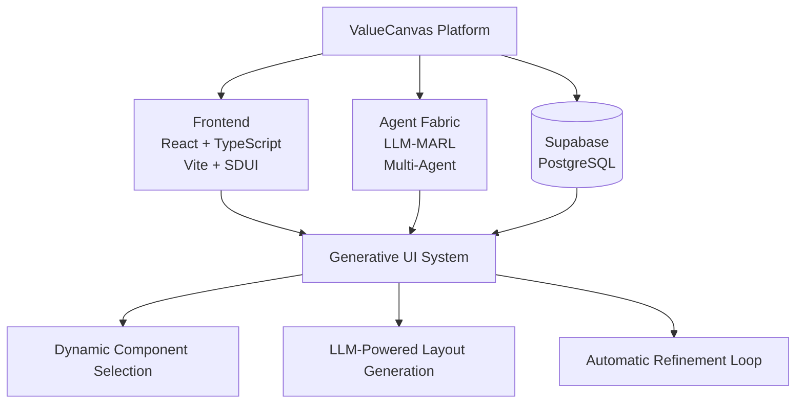
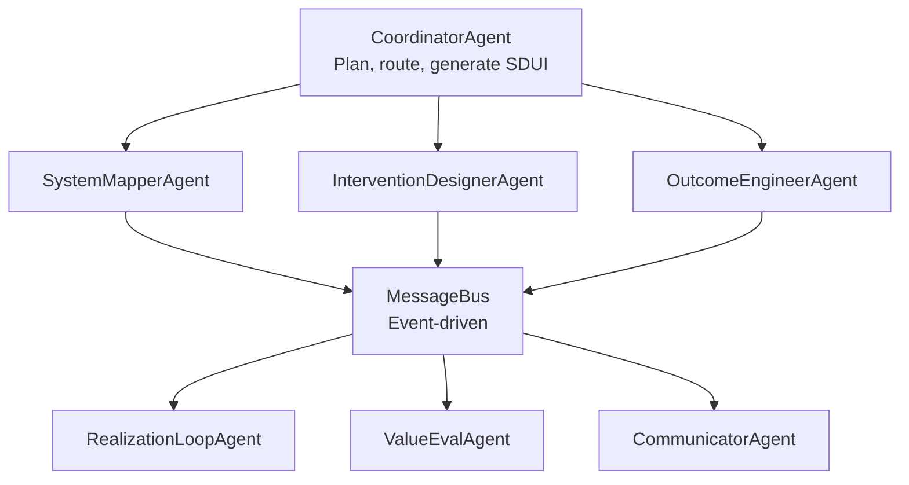
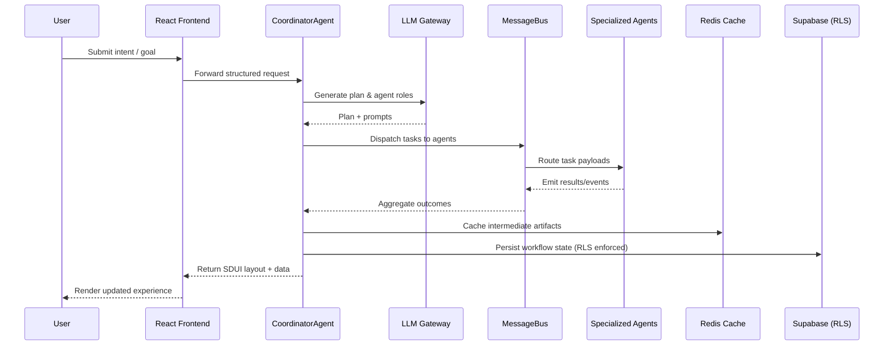
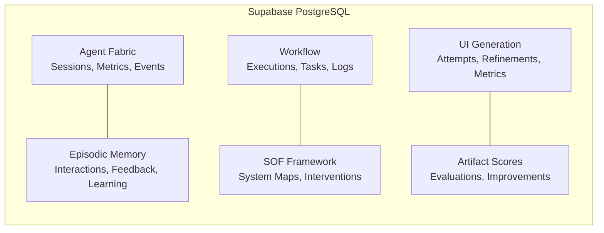
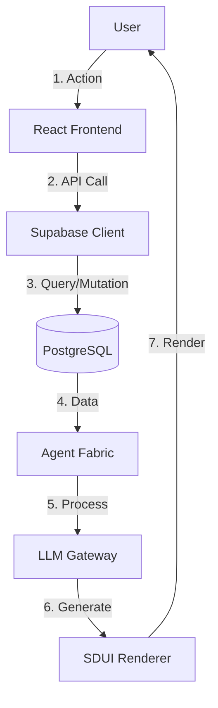
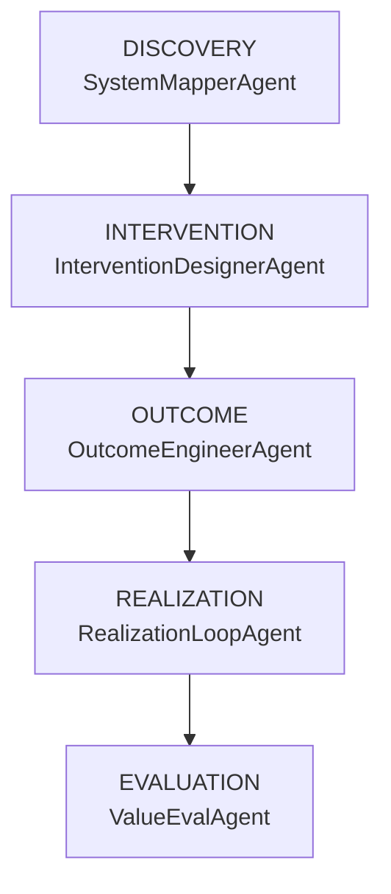
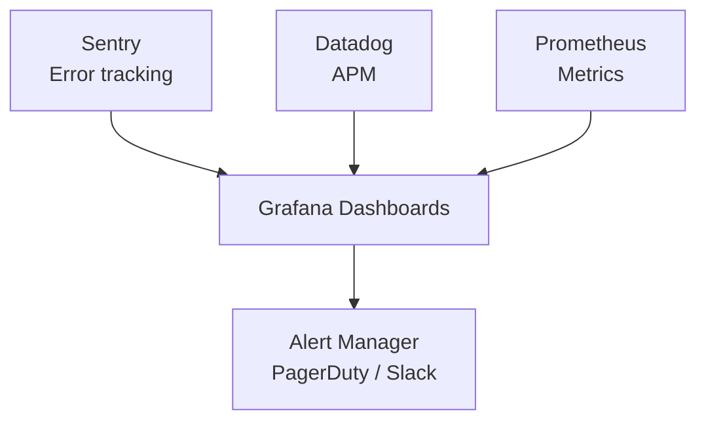
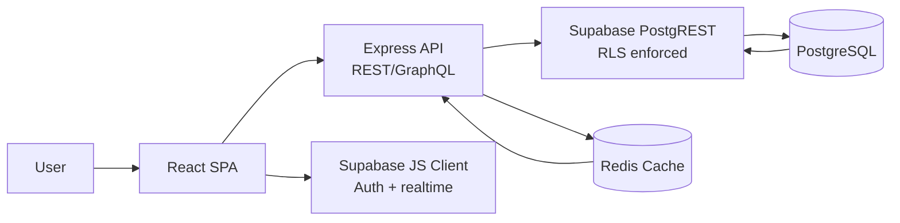

# Architecture Diagrams (Mermaid)

**Date:** November 22, 2024  
**Purpose:** Visual representation of ValueCanvas architecture  
**Status:** Mermaid diagrams rendered natively in GitHub/IDE preview

---

## System Overview



---

## LLM-MARL Agent System



---

## Agent Orchestration Loop (Sequence)



---

## Generative UI Flow

```mermaid
graph TD
    USER[User Intent] --> COORD[CoordinatorAgent\nParse intent + plan]
    COORD --> LLM[LLM Gateway\nTogether.ai / OpenAI]
    LLM --> COMPSEL[Component Selection\nRegistry search]
    COMPSEL --> LAYOUT[Layout Generation\nStructure & bindings]
    LAYOUT --> REFINE[Refinement Loop (3x)\nEvaluate & improve]
    REFINE --> RENDER[SDUI Renderer\nHydrate data]
    RENDER --> UI[User Interface]
```

---

## Database Schema Overview



---

## Request Flow



---

## SOF Framework Flow



---

## Deployment Architecture

```mermaid
graph TD
    subgraph Production
        VERCEL[Vercel Frontend Hosting]
        SUPA[Supabase Backend + Database]
        SENTRY[Sentry Monitoring]
        CDN[CDN (Global)\nStatic assets + edge caching]
        LB[Load Balancer]
        US[Region US-E]
        EU[Region EU-W]
        AP[Region AP-SE]
    end

    VERCEL --> CDN
    CDN --> LB
    LB --> US
    LB --> EU
    LB --> AP
    SUPA -.-> SENTRY
```

---

## Security Architecture

```mermaid
graph TD
    NET[Layer 1: Network Security\nHTTPS/TLS 1.3, WAF, DDoS, Rate Limiting]
    APP[Layer 2: Application Security\nCSP, CSRF, Input Sanitization, XSS Prevention]
    AUTH[Layer 3: AuthN/AuthZ\nSupabase Auth (JWT), RLS, RBAC, MFA]
    DATA[Layer 4: Data Security\nAt-rest encryption, TLS in transit, bcrypt, Audit Logging]

    NET --> APP --> AUTH --> DATA
```

---

## Monitoring & Observability



---

## Component Diagram (React, Express, Supabase, Redis)



---

## Data Flow & Compliance Overlay

```mermaid
flowchart LR
    subgraph Internet Boundary
        U[User Browser]
    end

    subgraph VPC Boundary
        FE[React Frontend]
        API[Express API]
        CACHE[(Redis Cache)]
    end

    subgraph Database Boundary
        DB[(Supabase PostgreSQL\nRLS enforced)]
    end

    U -- TLS 1.3 --> FE
    FE -- JWT + HTTPS --> API
    FE -- WebSocket (realtime) --> DB
    API -- TLS + Row-level policies --> DB
    API -- PII cache TTL --> CACHE
    CACHE -- Encrypted at-rest (disk) --> API
    DB -- Encrypted backups --> DB

    FE -- AI prompt payloads --> API
    API -- AI prompt templates --> DB
    FE -- TLS termination noted at LB --> API
    API -- Encrypt at-rest (KMS) --> DB

    classDef pii stroke:#d33,stroke-width:2,color:#d33;
    classDef ai stroke:#6f42c1,stroke-width:2,color:#6f42c1;
    classDef secure stroke:#0a9396,stroke-width:2,color:#0a9396;

    %% Edge order: 0..10
    linkStyle 1 stroke:#d33,stroke-width:2,color:#d33;
    linkStyle 2 stroke:#d33,stroke-width:2,color:#d33;
    linkStyle 3 stroke:#d33,stroke-width:2,color:#d33;
    linkStyle 4 stroke:#d33,stroke-width:2,color:#d33;

    linkStyle 7 stroke:#6f42c1,stroke-width:2,color:#6f42c1;
    linkStyle 8 stroke:#6f42c1,stroke-width:2,color:#6f42c1;

    linkStyle 9 stroke:#0a9396,stroke-width:2,color:#0a9396;
    linkStyle 10 stroke:#0a9396,stroke-width:2,color:#0a9396;
```

- **Trust Boundaries:** Internet vs. VPC vs. Database are modeled as subgraphs.  
- **PII/AI Prompts:** Edges marked with red (PII) or purple (AI prompt) strokes.  
- **RLS Enforcement:** Explicitly shown on Supabase node and API ➜ DB edge.  
- **Encryption Boundaries:** TLS on ingress and database encryption highlighted on relevant edges.

---

## Integration Cookbook (Enterprise)

### SSO (Okta / Azure AD)
- Configure OIDC/SAML app with redirect URI: `https://<your-domain>/auth/callback`.
- Enable groups/roles claims for RBAC mapping.
- Supabase JWT audience must match client ID.
- Example Helm snippet:

```yaml
supabase:
  auth:
    external:
      enabled: true
      providers:
        - name: okta
          clientId: ${OKTA_CLIENT_ID}
          clientSecret: ${OKTA_CLIENT_SECRET}
          issuer: https://<your-okta-domain>/oauth2/default
        - name: azuread
          clientId: ${AZURE_AD_CLIENT_ID}
          clientSecret: ${AZURE_AD_CLIENT_SECRET}
          issuer: https://login.microsoftonline.com/<tenant-id>/v2.0
```

### SIEM (Splunk / Datadog)
- Export audit logs via Fluent Bit sidecar or Supabase log drains.
- Ship HTTP event stream to Splunk HEC or Datadog Logs intake.
- Network allow-lists: Splunk HEC (`8088/tcp`), Datadog intake (`443/tcp`).
- Terraform snippet for Datadog log pipeline:

```hcl
resource "datadog_logs_custom_pipeline" "valuecanvas_audit" {
  name = "valuecanvas-audit"
  is_enabled = true
  processors_json = jsonencode([
    {
      type       = "grok_parser",
      name       = "parse_audit",
      samples    = ["ts=... user=... action=..."],
      grok       = { support_rules = "", match_rules = "audit %{data:json}" }
    }
  ])
}
```

### Secrets (AWS Secrets Manager / HashiCorp Vault)
- Inject credentials as environment variables for Express and worker pods.
- Rotate keys automatically; prefer short-lived tokens.
- Network allow-lists: AWS Secrets Manager (`443/tcp`), Vault API (`8200/tcp`).
- Helm snippet for Vault Agent injector:

```yaml
vault:
  annotations:
    vault.hashicorp.com/agent-inject: "true"
    vault.hashicorp.com/role: "valuecanvas-api"
    vault.hashicorp.com/agent-inject-secret-config: "secret/data/valuecanvas/api"
    vault.hashicorp.com/agent-inject-template-config: |
      {{- with secret "secret/data/valuecanvas/api" -}}
      export SUPABASE_SERVICE_ROLE="{{ .Data.data.supabase_service_role }}"
      export REDIS_PASSWORD="{{ .Data.data.redis_password }}"
      {{- end -}}
```

