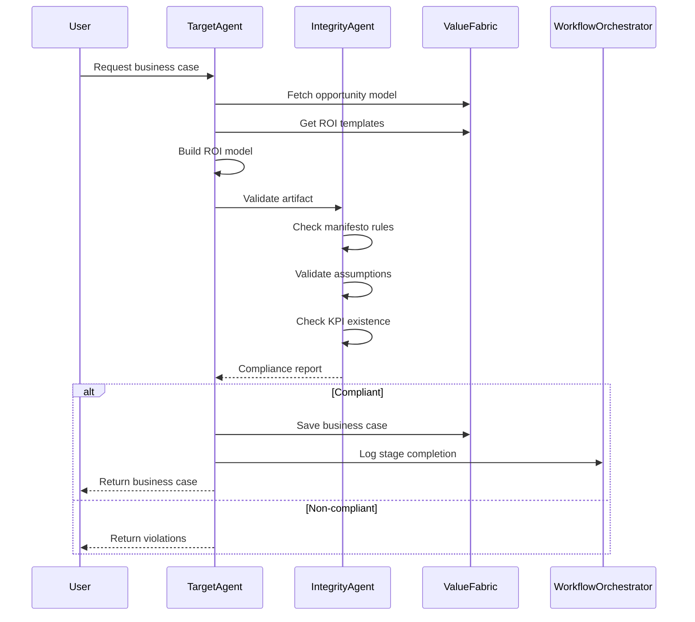

# Value Operating System (VOS) - Technical Architecture

## Overview

The Value Operating System is a manifesto-driven, AI-native platform for orchestrating customer value across the entire enterprise lifecycle. This document describes the technical architecture implementing the VOS Manifesto principles.

## Architecture Layers

```
┌──────────────────────────────────────────────────────────────┐
│                    Layer 4: Engagement                        │
│    Marketing | Sales | CS | Product | Partners | Executives  │
└────────────────────────────┬─────────────────────────────────┘
                             │
┌────────────────────────────▼─────────────────────────────────┐
│              Layer 3: Lifecycle Execution                     │
│   Opportunity → Target → Realization → Expansion              │
└────────────────────────────┬─────────────────────────────────┘
                             │
┌────────────────────────────▼─────────────────────────────────┐
│         Layer 2: AI Orchestration & Agent Fabric              │
│   GenAI | Predictive Models | Agentic Reasoning | Automation │
└────────────────────────────┬─────────────────────────────────┘
                             │
┌────────────────────────────▼─────────────────────────────────┐
│            Layer 1: Value Architecture                        │
│     Value Tree | ROI Engine | Messaging Framework            │
└────────────────────────────┬─────────────────────────────────┘
                             │
┌────────────────────────────▼─────────────────────────────────┐
│         Layer 0: Foundation & Governance                      │
│   Unified Value Language | Standards | Data Model            │
│              MANIFESTO RULES ENGINE                           │
└──────────────────────────────────────────────────────────────┘
```

## Layer 0: Foundation & Governance

### Manifesto Rules Engine
**Location**: `src/lib/manifesto/ManifestoRules.ts`

Implements 12 core manifesto principles with automated validation:

1. **Value is the First Principle** - Outcomes over features
2. **Unified Enterprise Value** - Single value language
3. **Standardized Structure** - Consistent architecture
4. **Conservative Quantification** - Credibility over hype
5. **Full Lifecycle Span** - Complete coverage
6. **Team Sport** - Cross-functional participation
7. **AI Augmentation** - Intelligent automation
8. **Continuous Proof** - Always measurable
9. **Governed System** - Versioned and auditable
10. **Revenue, Cost, Risk** - Universal value levers
11. **Multiplicative Impact** - 8× value multiplier
12. **Moral Contract** - Integrity and transparency

### Database Schema
**Location**: `supabase/migrations/`

Core tables implementing the value fabric:

- **Value Ontology**: `business_objectives`, `capabilities`, `kpis`, `benchmarks`
- **Lifecycle Artifacts**: `opportunity_artifacts`, `target_artifacts`, `realization_artifacts`, `expansion_artifacts`, `integrity_artifacts`
- **Workflow Orchestration**: `workflow_definitions`, `workflow_executions`, `workflow_execution_logs`
- **Agent System**: `agent_sessions`, `agent_memory`, `agent_audit_logs`

All tables include:
- Row-level security (RLS)
- Audit timestamps
- Version tracking
- Compliance metadata

## Layer 1: Value Architecture

### Value Tree
Canonical structure: **Capabilities → Outcomes → KPIs → Financial Impact**

```typescript
{
  capabilities: [
    {
      id: string,
      name: string,
      description: string,
      outcomes: [
        {
          id: string,
          outcome: string,
          kpis: [
            {
              id: string,
              metric: string,
              baseline: number,
              target: number,
              financial_impact: {
                revenue: number,
                cost: number,
                risk: number
              }
            }
          ]
        }
      ]
    }
  ]
}
```

### ROI Engine
**Service**: `src/services/ROIFormulaInterpreter.ts`

Features:
- Formula parsing and execution
- Assumption validation
- Sensitivity analysis
- NPV, IRR, payback calculations
- Conservative estimates enforcement

### Value Fabric Service
**Service**: `src/services/ValueFabricService.ts`

Central repository for:
- Value model storage
- KPI definitions
- Benchmark data
- Consistency validation
- Semantic alignment

## Layer 2: AI Orchestration & Agent Fabric

### Multi-Agent System
**Location**: `src/lib/agent-fabric/`

Five specialized agents implementing manifesto principles:

#### 1. Opportunity Agent
**File**: `agents/OpportunityAgent.ts`

**Manifesto Rules**: Value defined by outcomes, Personalize at edge

**Responsibilities**:
- Persona research
- Value discovery
- Feature → Outcome mapping
- Initial opportunity modeling

#### 2. Target Agent
**File**: `agents/TargetAgent.ts`

**Manifesto Rules**: Quantify credibly, Align to objectives

**Responsibilities**:
- ROI modeling
- Assumption validation
- Business case generation
- Executive validation prep

#### 3. Realization Agent
**File**: `agents/RealizationAgent.ts`

**Manifesto Rules**: Continuously proven

**Responsibilities**:
- Telemetry ingestion
- Actual vs. committed tracking
- Value realization reports
- Renewal risk detection

#### 4. Expansion Agent
**File**: `agents/ExpansionAgent.ts`

**Manifesto Rules**: Value must compound

**Responsibilities**:
- Benchmark comparison
- Gap analysis
- Expansion ROI modeling
- Upsell case building

#### 5. Integrity Agent
**File**: `agents/IntegrityAgent.ts`

**Manifesto Rules**: ALL manifesto principles

**Responsibilities**:
- Manifesto compliance validation
- Assumption normalization
- Narrative alignment
- Conflict resolution
- Compliance stamping

### Agent Communication

**Protocol**: Event-driven via Value Fabric

**Event Topics**:
- `value.opportunity.created`
- `value.target.defined`
- `value.realization.updated`
- `value.expansion.triggered`
- `manifesto.violation.detected`

### LLM Gateway
**Service**: `src/lib/agent-fabric/LLMGateway.ts`

- Model routing
- Prompt templates
- Response parsing
- Rate limiting
- Cost tracking

### Memory System
**Service**: `src/lib/agent-fabric/MemorySystem.ts`

- Short-term (session)
- Long-term (customer history)
- Semantic search
- Context retrieval

## Layer 3: Lifecycle Execution

### Workflow Orchestration
**Service**: `src/services/WorkflowOrchestrator.ts`

**Features**:
- DAG execution (sequential stages)
- Retry logic (exponential backoff + jitter)
- Circuit breakers (5-failure threshold, 60s cooldown)
- State machine tracking
- Event logging

**Stages**:
1. **Opportunity Discovery** → Persona fit, value hypothesis
2. **Target Commitment** → ROI model, business case
3. **Realization Tracking** → Telemetry, proof reports
4. **Expansion Planning** → Benchmarks, upsell ROI

### Workflow Compensation
**Service**: `src/services/WorkflowCompensation.ts`

**Saga Pattern Implementation**:
- Reverse-order rollback
- Stage-specific compensation handlers
- Artifact cleanup
- State reversion

### Error Handling
**Component**: `src/components/Workflow/WorkflowErrorPanel.tsx`

Visual display of:
- Failed stages
- Retry attempts
- Error messages
- Rollback options

## Layer 4: Engagement Layer

### User Interfaces

#### Lifecycle Workspaces
- **OpportunityWorkspace** (`src/views/OpportunityWorkspace.tsx`)
- **TargetROIWorkspace** (`src/views/TargetROIWorkspace.tsx`)
- **ExpansionInsightPage** (`src/views/ExpansionInsightPage.tsx`)
- **IntegrityCompliancePage** (`src/views/IntegrityCompliancePage.tsx`)

#### Enterprise Settings
- **SettingsView** (`src/views/Settings/SettingsView.tsx`)
- Organization, Team, User tiers
- RBAC and permissions
- Audit logging

## Data Flow Example

### Creating a Target Business Case



## Security Architecture

### Authentication & Authorization
- Supabase Auth (email/password)
- Row-level security (RLS) on all tables
- Role-based access control (RBAC)
- Organization/Team/User hierarchy

### Data Protection
- Encrypted at rest
- TLS in transit
- PII handling policies
- Audit trail for all access

### Manifesto Enforcement
- All outputs validated by IntegrityAgent
- Non-compliant artifacts quarantined
- Auto-remediation suggestions
- Immutable rule engine

## Scalability Design

### Horizontal Scaling
- Stateless agents
- Event-driven communication
- Distributed workflow execution
- Caching at multiple levels

### Performance Optimization
- Lazy loading
- Optimistic updates
- Virtual scrolling
- Query optimization

## Monitoring & Observability

### Metrics
- Agent execution time
- Workflow success rate
- Manifesto compliance rate
- Value realization accuracy

### Logging
- Agent decision traces
- Workflow events
- Manifesto violations
- User actions

### Dashboards
- Value throughput
- Realization performance
- Agent health
- Rule violations

## Technology Stack

### Frontend
- **Framework**: React 18 + TypeScript
- **Build**: Vite
- **Styling**: Tailwind CSS
- **Icons**: Lucide React
- **State**: React Context

### Backend Services
- **Database**: Supabase (PostgreSQL)
- **Real-time**: Supabase Realtime
- **Storage**: Supabase Storage
- **Auth**: Supabase Auth

### AI/ML
- **LLM Gateway**: Configurable (OpenAI, Anthropic, etc.)
- **Vector Store**: Planned (Qdrant/Pinecone)
- **Embeddings**: Planned

## Deployment Architecture

### Infrastructure
- **Frontend**: Static hosting (Vercel/Netlify)
- **Database**: Supabase managed PostgreSQL
- **Edge Functions**: Supabase Edge Functions
- **CDN**: Cloudflare/CloudFront

### CI/CD
- GitHub Actions
- Automated testing
- Database migrations
- Security scanning

## File Organization

```
project/
├── src/
│   ├── lib/
│   │   ├── agent-fabric/          # Multi-agent system
│   │   │   ├── agents/            # Individual agents
│   │   │   ├── AgentFabric.ts     # Orchestrator
│   │   │   ├── LLMGateway.ts      # LLM interface
│   │   │   └── MemorySystem.ts    # Agent memory
│   │   ├── manifesto/             # Manifesto engine
│   │   │   └── ManifestoRules.ts  # Rule definitions
│   │   └── supabase.ts            # Database client
│   ├── services/                  # Business logic
│   │   ├── WorkflowOrchestrator.ts
│   │   ├── WorkflowCompensation.ts
│   │   ├── ValueFabricService.ts
│   │   ├── ROIFormulaInterpreter.ts
│   │   └── ...
│   ├── components/                # React components
│   │   ├── Workflow/
│   │   ├── Agent/
│   │   ├── Canvas/
│   │   └── Settings/
│   ├── views/                     # Page-level components
│   │   ├── OpportunityWorkspace.tsx
│   │   ├── TargetROIWorkspace.tsx
│   │   └── Settings/
│   └── types/                     # TypeScript types
│       ├── index.ts
│       ├── vos.ts
│       └── workflow.ts
├── supabase/
│   └── migrations/                # Database schema
└── docs/
    ├── VOS_MANIFESTO.md          # Core principles
    └── VOS_ARCHITECTURE.md       # This file
```

## Future Enhancements

### Planned Features
1. **Real-time collaboration** - Multi-user editing
2. **Advanced analytics** - Predictive modeling
3. **Industry value packs** - Pre-built templates
4. **Partner ecosystem** - Channel enablement
5. **Mobile apps** - iOS/Android clients

### Agent Extensions
1. **Company Intelligence Agent** - Research automation
2. **Financial Modeling Agent** - Advanced calculations
3. **Value Mapping Agent** - Automated capability mapping
4. **Knowledge Orchestrator** - Multi-agent coordination

## References

- [VOS Manifesto](./VOS_MANIFESTO.md)
- [Agent Fabric Documentation](./AGENT_FABRIC_README.md)
- [Services API](./SERVICES_API.md)
- [Workflow Orchestration](./src/workflows/README.md)

---

**Version**: 1.0
**Last Updated**: 2025-11-17
**Maintained By**: VOS Development Team
