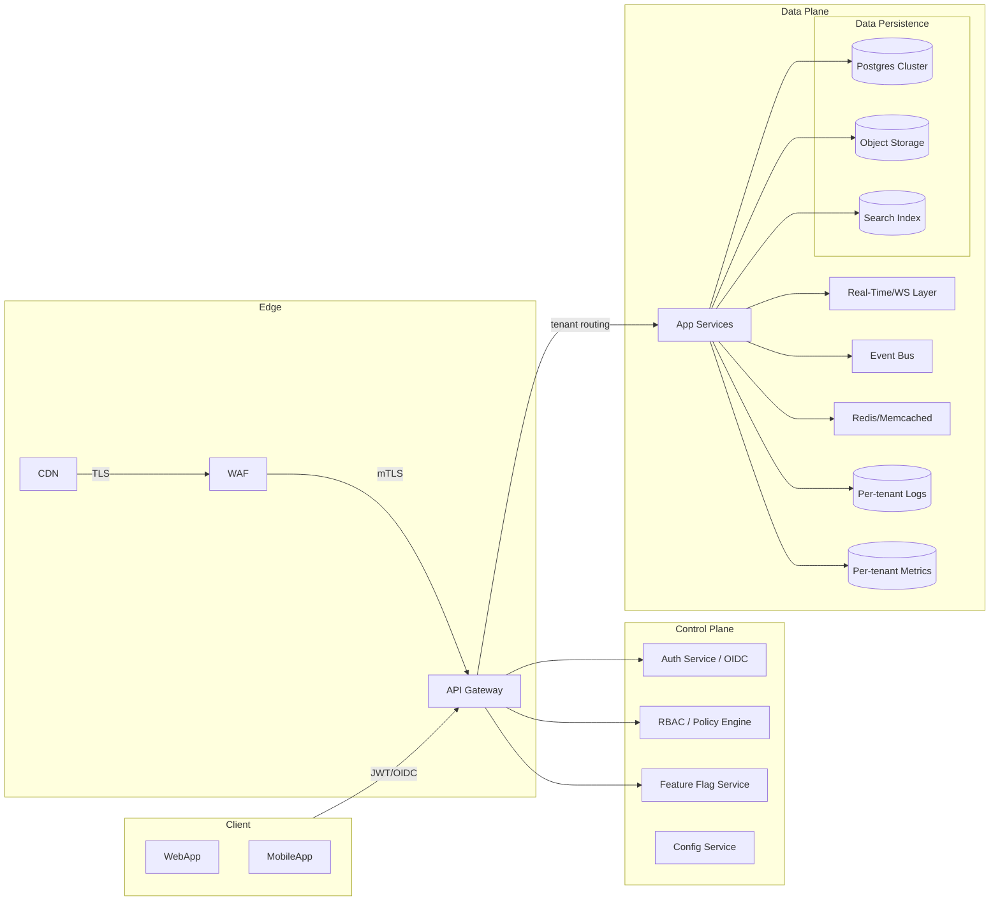

# Multi-Tenant Infrastructure and UI Implementation Plan

## 1. Architecture Overview

### 1.1 High-Level Data Flow


### 1.2 Deployment Topology
- **Kubernetes** with separate namespaces per environment; tenant-aware workloads use node pools with pod security standards (PSPs replacement via OPA Gatekeeper/PSA).
- **Ingress** via managed load balancer + CDN + WAF; API Gateway (Kong/Apigee) handles tenant-aware routing, rate limiting, and auth offload.
- **Services** are stateless, horizontally scalable, with autoscaling based on CPU/RAM and custom SLI (p95 latency, error rate) using HPA + KEDA for async workers.
- **Data tier** uses a hybrid strategy: shared Postgres cluster with row-level security for small tenants and isolated schemas; large/regulated tenants get dedicated databases via operator-managed instances.
- **Observability** pipeline: per-tenant log indices (e.g., Loki/ELK with index prefix), metrics with tenant labels (Prometheus/OpenTelemetry), and traces with tenant IDs.

## 2. Tenant Isolation Strategy
- **Tenant identifier**: `tenant_id` UUID carried via `iss`/`tid` claim in JWT and propagated in headers (`X-Tenant-ID`) and tracing context.
- **Shared-cluster / isolated-schema**: default path; every tenant gets its own schema (`tenant_<uuid>`) with row-level security enforcing `tenant_id` match. Connection poolers (PgBouncer) route based on schema map.
- **Dedicated database option**: provisioned through control-plane automation (operators/terraform) when tenant size or compliance demands; logical replication supports migrations between tiers.
- **Object storage**: bucket prefixing per tenant with server-side encryption and bucket policies preventing cross-tenant access.
- **Search indices**: per-tenant index or index alias with tenant filter context.

### 2.1 Database Schema Sketch
```sql
-- Global metadata schema
CREATE TABLE public.tenants (
  id UUID PRIMARY KEY,
  name TEXT NOT NULL,
  tier TEXT CHECK (tier IN ('standard','enterprise')),
  status TEXT NOT NULL,
  created_at TIMESTAMPTZ DEFAULT now(),
  updated_at TIMESTAMPTZ DEFAULT now()
);

-- Tenant-local schema template (per tenant)
CREATE TABLE tenant_<tenant_id>.users (
  id UUID PRIMARY KEY,
  email CITEXT UNIQUE,
  hashed_password TEXT NOT NULL,
  role TEXT NOT NULL,
  created_at TIMESTAMPTZ DEFAULT now()
);

CREATE TABLE tenant_<tenant_id>.projects (
  id UUID PRIMARY KEY,
  name TEXT NOT NULL,
  owner_id UUID REFERENCES tenant_<tenant_id>.users(id),
  created_at TIMESTAMPTZ DEFAULT now()
);

-- Row-Level Security example on shared tables
ALTER TABLE tenant_shared.events ENABLE ROW LEVEL SECURITY;
CREATE POLICY tenant_isolation ON tenant_shared.events
  USING (tenant_id = current_setting('app.current_tenant')::uuid);
```

## 3. API Specifications (Tenant-Aware)
- **Versioning**: `/v1/{tenantId}/...` for path scoping plus header validation to avoid spoofing.
- **Auth**: OIDC-compliant JWT bearer; API Gateway verifies signature, expiration, issuer, and tenant binding. RBAC handled by policy engine (OPA/Topaz) with tenant-scoped roles.
- **Rate limiting**: tier-based (e.g., standard 100 rps, enterprise negotiated) enforced at gateway; burst controls per client.
- **Idempotency**: `Idempotency-Key` header for POST/PUT.

| Method | Endpoint | Description | Notes |
| --- | --- | --- | --- |
| `GET` | `/v1/{tenantId}/users/me` | Returns profile for authenticated user | tenantId must match JWT `tid` |
| `POST` | `/v1/{tenantId}/projects` | Create project | Requires `role:project_admin` |
| `GET` | `/v1/{tenantId}/projects/{projectId}` | Fetch project | Enforces tenant RLS |
| `POST` | `/v1/{tenantId}/events` | Emit audit/business event | Writes to per-tenant topic/stream |
| `GET` | `/v1/{tenantId}/config` | Fetch feature flags/config | Cached per tenant |
| `POST` | `/v1/{tenantId}/invites` | Invite member | Triggers email via tenant-aware templates |

### Example Handler (Node/TypeScript)
```ts
import { z } from "zod";
import { getTenantContext } from "@platform/tenant-context";
import { authorize } from "@platform/rbac";
import { db } from "@platform/db";

const schema = z.object({ name: z.string().min(3) });

export async function createProject(req, res) {
  const { tenantId, user } = getTenantContext(req); // from gateway headers + JWT
  authorize(user, tenantId, "project:create");
  const body = schema.parse(req.body);
  await db.withTenant(tenantId).query(
    "INSERT INTO projects (id, name, owner_id) VALUES (gen_random_uuid(), $1, $2)",
    [body.name, user.id]
  );
  res.status(201).json({ ok: true });
}
```

## 4. Security Implementation Plan
- **Threat Modeling (STRIDE)**
  - **Spoofing**: enforce OIDC, mutual TLS between services, signed gateway headers for tenant ID.
  - **Tampering**: all data in transit via TLS 1.2+, immutable audit logs, integrity checksums for object storage.
  - **Repudiation**: append-only audit trail with actor, tenant, timestamp; time-synchronized via NTP.
  - **Information Disclosure**: RLS, separate schemas/dbs, secret management (Vault/Secrets Manager), data minimization.
  - **DoS**: WAF rules, rate limiting per tenant, circuit breakers, autoscaling, per-tenant queue backpressure.
  - **Elevation of privilege**: RBAC with least privilege, policy as code, periodic access reviews.

- **Encryption**
  - At rest: DB-native TDE + disk encryption; object storage SSE-KMS; secrets in HSM-backed KMS.
  - In transit: TLS everywhere; mTLS for service-to-service; HSTS on edge.

- **Onboarding**
  - Automated tenant provisioning pipeline (workflow + infra as code) that creates schema/db, seeds configs, sets billing + rate limits, issues branding settings.
  - Integrate domain verification for custom domains (DNS/TXT + ACME cert automation).

- **Offboarding**
  - Grace period lock, export data, revoke credentials, destroy schemas/dbs, scrub caches/indices, update billing.

- **Audit & Compliance**
  - Append-only event stream per tenant feeding SIEM.
  - Access logs for admin actions with dual-control.

- **Backup/DR**
  - Per-tenant logical backups (pg_dump per schema) + periodic full backups; object storage versioning.
  - RPO <= 15 minutes via WAL shipping/streaming replication; RTO <= 1 hour via hot standby failover.

## 5. UI/Frontend Specifications
- **Branding**: theme tokens per tenant (colors, logo, typography) loaded via config endpoint; fallback theme cached in CDN.
- **Feature Flags**: client SDK fetches tenant + user scoped flags; evaluate locally with remote updates via SSE/WebSocket.
- **Tenant Dashboard**: modules for usage, members, billing, audit logs, security posture; cards built from composable components.
- **Responsiveness**: CSS grid/flex with mobile-first breakpoints; skeleton states for <200ms target.
- **Accessibility**: WCAG 2.1 AA—focus management, ARIA labels, color contrast checks in CI (axe-core/pa11y).
- **Real-time**: WebSocket channel namespaced by tenant; fall back to long polling if blocked.

### UI Component Spec (React + Tailwind Example)
```tsx
// Tenant-aware layout wrapper
export function TenantShell({ tenant, children }) {
  return (
    <div className={`min-h-screen bg-${tenant.theme.background}`}>
      <Header logo={tenant.branding.logo}>
        <TenantSwitcher tenants={tenant.accessibleTenants} />
        <UserMenu />
      </Header>
      <main className="p-6 space-y-4">{children}</main>
      <Toaster position="top-right" />
    </div>
  );
}

// Feature-flagged component usage
{featureFlags["billing.usage"] && <UsageCard data={usage} />}
```

### Wireframe Notes
- **Dashboard**: hero summary (uptime, usage, seats), tabs for Projects, Members, Settings, Audit.
- **Settings**: Branding (logo upload + preview), Security (SSO/SAML, MFA enforcement), Notifications (email/webhook destinations), Feature toggles.
- **Activity/Audit**: filter by actor, resource, timeframe; export CSV; realtime stream badge.

## 6. Deployment and Scaling Strategy
- **CI/CD**: trunk-based with gated merges; SAST/DAST/IAST; infra as code (Terraform/Helm); canary + feature flag rollouts.
- **Capacity Planning**: start with 3x application replicas per AZ; autoscale to meet p95 <200ms; rate limit to protect shared resources.
- **Data Scaling**: partition large tables by tenant/time; read replicas for analytics; use connection pooling; background workers for heavy jobs.
- **Cache Strategy**: tenant-scoped keys; TTL for hot paths; signed URLs for CDN caching of public assets.
- **Resilience**: circuit breakers, retries with jitter, bulkheads per tenant tier.

## 7. Testing Strategy
- **Unit/Contract Tests**: tenant context propagation, RBAC decisions, RLS enforcement.
- **Integration**: simulate multi-tenant traffic with synthetic tenants; ensure no cross-tenant data returned.
- **Security**: pen tests, fuzzing, dependency scanning, OPA policy tests, JWT validation tests, CSRF/XSS checks for UI.
- **Performance**: k6/Gatling scenarios per tier; target p95 <200ms; chaos experiments (pod kill, DB failover) to verify DR.
- **Accessibility**: automated axe/pa11y in CI + manual keyboard + screen reader passes.

## 8. Documentation for Developers & Administrators
- **Runbooks**: provisioning, tenant migration between shared/dedicated DB, incident response per tenant, key rotation.
- **Playbooks**: onboarding/offboarding checklist, emergency tenant isolation, backfill/repair scripts.
- **Developer Guides**: tenant context middleware, how to add tenant-aware endpoints, schema template instructions.
- **Admin Dashboards**: Grafana per-tenant folders, Kibana/Loki queries with tenant labels, alert rules referencing tenant SLAs.

## 9. Compliance Alignment (SOC 2, Privacy)
- Logging and audit retention with immutability controls; least-privilege access via SSO + MFA.
- Change management tracked via tickets and code reviews; risk assessments for new features.
- Data processing agreements and regional residency via tenant metadata (region tag -> DB/obj store placement).
- Privacy-by-design: data minimization, purpose limitation, explicit consent for notifications, right-to-erasure workflow.

---
**Scalability Targets**: Start with 1,000 tenants on shared cluster; automated workflows promote high-volume tenants to dedicated DBs. HPA keeps p95 <200ms, multi-AZ ensures 99.9% uptime, and DR SLAs maintain RPO/RTO targets.
