# VOS Academy & Enterprise Portal Knowledge Graph

This document presents a structured knowledge graph representing the architecture, relationships, and user flows of the **Value Operating System (VOS) Academy and Enterprise Portal**. 

It integrates the **Learning Academy**, **Resource Library**, and **Technical Documentation** into a unified "Agent-Assisted Professional Education System" designed for Value Engineering and Outcome-Based Selling.

---

## 1. Visual Knowledge Graph (Mermaid Architecture)

This diagram visualizes the high-level interconnections between the portal's core hubs and the VOS lifecycle.

```mermaid
graph TD
    %% Core Portal Hubs
    Portal[("VOS Enterprise Portal")]
    Academy[("🎓 Learning Academy<br>(Agent-Assisted)")]
    Docs[("📘 Documentation<br>(Technical & Config)")]
    Resources[("🛠️ Resource Library<br>(Artifacts & Tools)")]
    Community[("👥 Community<br>(Value Ledger)")]

    %% Relationships - Portal to Hubs
    Portal --> Academy
    Portal --> Docs
    Portal --> Resources
    Portal --> Community

    %% CORE PILLARS (The Curriculum)
    subgraph Curriculum [7 Pillars of Value]
        P1(Pillar 1: Outcome Economics)
        P2(Pillar 2: Discovery & Diagnosis)
        P3(Pillar 3: Quantification & Modeling)
        P4(Pillar 4: Value Commit Creation)
        P5(Pillar 5: Realization Management)
        P6(Pillar 6: Expansion Strategy)
        P7(Pillar 7: Platform Operations)
    end

    %% AGENT FABRIC (The Enablers)
    subgraph Agents [Agent Fabric]
        DA[Discovery Agent]
        IA[Integrity Agent]
        KA[KPI/Quant Agent]
        RA[Realization Agent]
    end

    %% RESOURCE ARTIFACTS (The Tools)
    subgraph Artifacts [Resource Artifacts]
        T_Discovery[Discovery Map Template]
        T_ROI[ROI Calculator Model]
        T_Commit[Value Commit Doc]
        T_QBR[QBR Deck Template]
    end

    %% Relationships - Academy to Curriculum
    Academy --> Curriculum

    %% Relationships - Curriculum to Agents (Simulations)
    P2 -- "Uses for Simulation" --> DA
    P3 -- "Uses for Modeling" --> KA
    P4 -- "Governed by" --> IA
    P5 -- "Uses for Variance" --> RA

    %% Relationships - Curriculum to Resources (Synergy)
    P2 -- "Teaches usage of" --> T_Discovery
    P3 -- "Teaches usage of" --> T_ROI
    P4 -- "Teaches creation of" --> T_Commit
    P5 -- "Teaches presentation of" --> T_QBR

    %% Relationships - Documentation to Academy (Context)
    Docs -.->|"Contextual Injection"| P7
    Docs -.->|"API Configuration"| KA

    %% Relationships - Resources to Documentation (Support)
    T_ROI -.->|"Formula Logic Reference"| Docs
    
    %% User Flow (Onboarding to Cert)
    User((User)) -->|Onboarding| P1
    P7 -->|Capstone Project| Cert[Certification]
    Cert -->|Validates| Community
```

---

## 2. Structured Knowledge Graph (Nodes & Edges)

The following section details the specific Nodes (Entities), Properties, and Edges (Relationships) connecting the ecosystem.

### A. Central Node: VOS Enterprise Portal
*   **Type:** Platform Shell
*   **Properties:**
    *   *Architecture:* Server-Driven UI (SDUI)
    *   *Theme:* Dark Mode (#121212) with Neon Green (#39FF14) Accents
    *   *Mission:* Transform users from "operators" to "Value Engineers"
*   **Relationships:**
    *   `HOSTS` → **Learning Academy**
    *   `HOSTS` → **Resource Library**
    *   `HOSTS` → **Documentation Hub**
    *   `INTEGRATES` → **Agent Fabric** (Discovery, KPI, Integrity Agents)

---

### B. Node: Learning Academy (The Core)
*   **Type:** Educational System
*   **Properties:**
    *   *Methodology:* Outcome-Based Learning
    *   *Format:* Agent-Assisted Labs, Interactive SDUI Blocks
    *   *Goal:* Standardize Value Engineering discipline
*   **Sub-Nodes (Curriculum Pillars):**
    1.  **Pillar 1: Outcome Economics**
        *   `TEACHES` → Value Triad (Revenue, Cost, Risk)
        *   `PREREQUISITE_FOR` → Pillar 2
    2.  **Pillar 2: Discovery & Diagnosis**
        *   `USES_TOOL` → **Discovery Agent** (Mock Interview Simulation)
        *   `LINKS_TO_RESOURCE` → **Stakeholder Interview Script**
    3.  **Pillar 3: Quantification & KPI Modeling**
        *   `USES_TOOL` → **KPI Agent** (Quant modeling practice)
        *   `LINKS_TO_DOCS` → **ROI Engine Logic Guide**
    4.  **Pillar 4: Value Commit Creation**
        *   `PRODUCES_ARTIFACT` → **Value Commit Document**
        *   `GOVERNED_BY` → **Integrity Agent** (Checks assumption conservatism)
    5.  **Pillar 5: Realization & Adoption**
        *   `TEACHES_METRIC` → **Variance Tracking** (Planned vs. Actual)
        *   `LINKS_TO_RESOURCE` → **QBR Template**
    6.  **Pillar 6: Expansion Strategy**
        *   `TEACHES_STRATEGY` → Portfolio Value Management
    7.  **Pillar 7: Platform Operations**
        *   `LINKS_TO_DOCS` → **SDUI Registry**
        *   `LINKS_TO_DOCS` → **API Reference**

---

### C. Node: Resource Library (The Toolbox)
*   **Type:** Asset Repository
*   **Properties:**
    *   *Organization:* Categorized by Lifecycle Stage (Opportunity, Alignment, Realization, Expansion)
    *   *Access Control:* Version-controlled artifacts
*   **Sub-Nodes (Artifacts):**
    *   **ROI Calculator (Excel/Web)**
        *   `SUPPORTED_BY` → **Pillar 3 (Academy)**
        *   `VALIDATED_BY` → **Integrity Agent**
    *   **Value Commit Template**
        *   `REPRESENTS` → Governance Point (Alignment → Realization)
    *   **Industry Snapshots**
        *   `PROVIDES_DATA` → **Vertical-specific Benchmarks**
        *   `USED_IN` → **Discovery Agent Configuration**

---

### D. Node: Documentation (The Truth Source)
*   **Type:** Technical Knowledge Base
*   **Properties:**
    *   *Structure:* Hub-and-Spoke
    *   *Update Mechanism:* Dynamic "LexBase" (Auto-updates from code)
*   **Sub-Nodes:**
    *   **Platform Guide:** User manual for VOS interface.
    *   **Developer Hub:**
        *   `CONTAINS` → **SDUI Registry** (`academy.sdui.json`)
        *   `CONTAINS` → **Agent Configuration Guide** (Prompt libraries)
    *   **Governance Rules:**
        *   `DEFINES` → Conservative Modeling Standards
        *   `LINKED_FROM` → **Integrity Agent** alerts

---

## 3. Cross-Sectional User Flows (Synergies)

This section maps how a user moves through the graph to achieve specific outcomes.

### Flow 1: The "Value Engineer" Certification Journey
1.  **Entry:** User enters **Academy Dashboard**.
2.  **Learning:** Completes **Pillar 3 (Quantification)** module via SDUI interface.
3.  **Practice (Synergy):** Lesson triggers embedded **KPI Agent** for a modeling simulation.
4.  **Resource Access:** User downloads **ROI Calculator** from **Resource Library** sidebar to complete the assignment.
5.  **Validation:** User uploads completed model; **Integrity Agent** scans for "Aggressive Assumptions" (Governance Check).
6.  **Reference:** User consults **Documentation > Risk Adjustment** for correction logic.
7.  **Outcome:** User earns "Value Modeler" Badge.

### Flow 2: "Just-in-Time" Contextual Injection
1.  **Context:** User is in the main SaaS App (VOS Platform) creating a *Value Commit*.
2.  **Trigger:** User struggles with "Baseline" field.
3.  **Injection:** System identifies context and pulls **Academy Lesson: Baseline Capture** into a side panel.
4.  **Support:** Side panel also links to **Resource: Baseline Questionnaire** for immediate use.

---

## 4. Gaps & Strategic Opportunities

### Gap A: Partner Enablement (Ecosystem Pioneers)
*   **Current State:** Concept mentions "Partner Track" but lacks specific nodes.
*   **Graph Addition:**
    *   Create Node: **Partner Portal (White-Label)**.
    *   Relationship: `INHERITS_FROM` → **VOS Academy**.
    *   Resource: Co-branded Value Commit Templates.

### Gap B: Community Interaction (Value Ledger)
*   **Current State:** User-to-System focus; lacks Peer-to-Peer.
*   **Graph Addition:**
    *   Create Node: **Value Ledger Leaderboard**.
    *   Metric: Rank users by *Total Dollar Value Realized* (not just points).
    *   Relationship: **Certification** `UNLOCKS` access to **Expert Forum**.

### Gap C: Mobile Micro-Learning
*   **Current State:** Complex modeling is desktop-heavy.
*   **Graph Addition:**
    *   Create Node: **Mobile Lite Track**.
    *   Content: 5-minute video summaries of **Outcome Economics**.
    *   Relationship: `SYNCS_PROGRESS` to Main Academy.

---

## 5. Technical Integration Specifications (Metadata)

To implement this graph technically (e.g., in a Neo4j or Graph database), use the following schema:

*   **Entity: Module**
    *   `id`: string (e.g., `mod_pillar3`)
    *   `type`: `video` | `lab` | `quiz`
    *   `sdui_component`: string (e.g., `AgentCallDemo`)
*   **Entity: Resource**
    *   `id`: string (e.g., `res_roi_calc_v2`)
    *   `lifecycle_stage`: `alignment`
    *   `governance_required`: boolean (`true`)
*   **Entity: Agent**
    *   `id`: string (e.g., `agent_integrity`)
    *   `function`: `validation` | `simulation`
    *   `connected_modules`: array [`mod_pillar3`, `mod_pillar4`]

### Sample Interconnection Logic
> **IF** User fails **Pillar 3 Quiz** (>2 attempts)
> **THEN** Trigger **Recommended Resource**: "Deep Dive: Financial Modeling 101"
> **AND** Prompt **Documentation**: "How to use the Sensitivity Analysis Toggle"