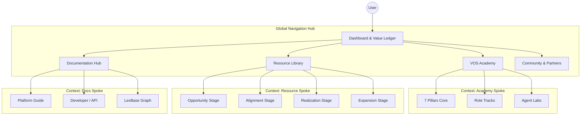

# VOS Enterprise Portal: Structural Architecture & Design Strategy

## 1. Strategic Foundation & User Experience Identity

The VOS Enterprise Portal is designed not as a passive repository of information, but as an **Agent-Assisted Professional Education System**. Its architecture facilitates the transition of users from operational task-doers to strategic "Value Engineers" who can quantify, commit to, and realize business value.

### Core Identity
*   **Mission:** Standardize the discipline of Value Engineering across the enterprise ecosystem.
*   **Visual Language:** Modern Minimalist Dark Mode (`#121212` Background) with High-Contrast Neon Green (`#39FF14` Accents) to signify precision, data intelligence, and "hacker-grade" capability.
*   **Primary Interaction Model:** Server-Driven UI (SDUI) enabling dynamic, context-aware content injection rather than static HTML pages.

---

## 2. Global Information Architecture (The "Hub-and-Spoke")

The portal utilizes a "Hub-and-Spoke" navigation structure. The **Global Hub** provides access to the four main pillars, while **Contextual Spokes** adapt based on the user's active role (e.g., Value Engineer vs. Developer).

---

## 3. Component I: The VOS Academy (The Core)

The Academy is the flagship component, functioning as a structured educational ecosystem rather than a simple video library. It integrates **Agent-Assisted Labs** where users practice skills against AI simulators before applying them to real accounts.

### A. Curriculum Architecture: The 7 Pillars of Value
*   **Purpose:** Establishing the universal language of Outcome Economics.
*   **Format:** Linear progression with "Gatekeeper" assessments governed by the **Integrity Agent**.

| Pillar Module | Content Types | Interactive Elements & Agent Labs | Outcome |
| :--- | :--- | :--- | :--- |
| **1. Outcome Economics** | Video, SDUI Text Blocks | **Simulator:** "The Value Triad" (Balance Revenue, Cost, Risk levers). | Ability to map basic ROI logic. |
| **2. Discovery & Diagnosis** | Interactive Scripts, Case Studies | **Discovery Agent Lab:** Mock interview roleplay. The AI plays a skeptical stakeholder; user must uncover root causes. | Completed "Discovery Map" artifact. |
| **3. Quantification** | Excel/Web Models, Methodology Guides | **KPI Agent Lab:** User inputs baseline data; Agent challenges assumptions (Sensitivity Analysis). | Verified "ROI Hypothesis" model. |
| **4. Value Commit Creation** | Templates, Legal/Governance Guides | **Integrity Agent Audit:** User submits a draft Value Commit; Agent flags "aggressive" assumptions vs. benchmarks. | "Value Commit" ready for customer sign-off. |
| **5. Realization Management** | Dashboards, Heatmaps | **Realization Agent Lab:** Variance tracking simulation. Analyze why actuals $\neq$ targets. | Ability to run a QBR (Quarterly Business Review). |
| **6. Expansion Strategy** | Strategy Decks, Narrative Arcs | **Scenario Modeler:** Input current value realized $\rightarrow$ Generate renewal/upsell narrative. | Expansion Proposal Deck. |
| **7. Platform Operations** | Technical Tutorials, API Docs | **Hands-on Sandbox:** Live VOS platform instance to configure workflows. | "VOS Certified Operator" status. |

### B. Role-Based Tracks (Personalization)
Users are segmented upon entry, triggering unique learning paths:
*   **Track A: Value Engineer (Deep Dive):** Focus on Pillar 3 (Quantification) & 4 (Commit). Heavy emphasis on Excel modeling and statistical risk adjustment.
*   **Track B: Account Executive (Storytelling):** Focus on Pillar 2 (Discovery) & 6 (Expansion). Emphasis on narrative, negotiation, and "defending the value."
*   **Track C: Developer (Technical):** Focus on Pillar 7 (Ops) + SDUI Architecture.

### C. Certification Strategy
*   **Level 1 (Practitioner):** Complete Core Pillars + Pass Knowledge Check.
*   **Level 2 (Professional):** Complete Role Track + Submit 1 Verified "Value Commit" (graded by Integrity Agent).
*   **Level 3 (Architect):** Capstone Project (Portfolio Value Management) + Peer Review via Community.

---

## 4. Component II: Resource Library (The "Toolbox")

The Resource Library is organized by the **Customer Lifecycle** (Source 9) rather than file type. This ensures users find the right tool for the specific "Governance Point" they are navigating.

### A. Lifecycle Organization
*   **Stage 1: Opportunity (Marketing/SDR)**
    *   *Artifacts:* Discovery Questionnaires, Stakeholder Persona Maps, Industry Benchmark Snapshots.
    *   *Integration:* Linked directly from the CRM "Opportunity" view via the **Discovery Agent**.
*   **Stage 2: Alignment (Sales/VE)**
    *   *Artifacts:* **Value Commit Template** (The central artifact), ROI Calculators (Excel/Web), Business Case Slide Decks.
    *   *Governance:* These assets are version-controlled. The system flags if a user downloads an outdated v1.0 calculator when v2.0 is live.
*   **Stage 3: Realization (CS/Post-Sales)**
    *   *Artifacts:* QBR/EBR Templates, Success Plan Schemas, Adoption Heatmap Configs.
    *   *Integration:* Pre-filled by the **Realization Agent** using live platform data before download.
*   **Stage 4: Expansion (Product/Growth)**
    *   *Artifacts:* Value Gap Analysis Models, Renewal Narrative Templates.

### B. "Smart" Assets
Resources are not static PDFs. They are "Smart Templates" embedded with:
*   **Data Ingestion Hooks:** An ROI calculator that auto-pulls the latest "Cost of Capital" metrics from the user's CRM integration.
*   **Version Guards:** If a template is deprecated, the portal prevents download and redirects to the new version.

---

## 5. Component III: Documentation Hub (The "LexBase")

This section houses the technical truth of the platform. It utilizes a **LexBase** architecture—a dynamic knowledge graph that auto-updates references when the core codebase changes.

### Structure
1.  **Platform Guide (Functional):**
    *   "How-to" guides for the VOS Interface.
    *   Contextual linking: Clicking "Help" inside the app opens the specific SDUI component guide in the side panel.
2.  **Developer Hub (Technical):**
    *   **SDUI Registry:** Documentation for the `academy.sdui.json` schema. Allows developers to build their own custom Academy lessons.
    *   **Agent Configuration:** Prompt engineering guides for customizing the *Discovery* and *Integrity* agents.
    *   **API Reference:** Endpoints for ingestion of signals (CRM, Usage Data).

---

## 6. Component IV: Community & Gamification ("Value Ledger")

Moving beyond vanity metrics (points/badges), the community is anchored in the **Value Ledger**.

### The Value Ledger Leaderboard
*   **Metric:** Users are ranked by **Total Value Realized ($)** across their accounts, not just quiz scores.
*   **Verification:** Requires the *Realization Agent* to confirm that a "Value Commit" was met with actual performance data.
*   **Incentive:** High-ranking "Value Architects" gain access to exclusive "Master Class" sessions and Beta features.

### Peer-to-Peer Exchange
*   **Model Exchange:** Users can upload anonymized industry models (e.g., "Manufacturing Risk Calculator") for peer review.
*   **Expert Connect:** "Ask a Value Engineer" forums routed to certified VOS Architects.

---

## 7. Technical Integration & Navigation Logic

### A. Search & "Just-in-Time" Discovery
*   **Semantic Search:** Queries like *"How do I handle a risk-averse CFO?"* map to *Pillar 2: Discovery* modules.
*   **Contextual Injection:** If a user lingers on the "Baseline" field in the main app for >10 seconds, the *Pillar 3: Baseline Capture* micro-lesson slides out from the right.

### B. The Agent Fabric
The portal is the "Home Base" for the agent ecosystem defined in the architecture:
*   **Discovery Agent:** Lives in *Academy Pillar 2* (Training) and *Resource Library Stage 1* (Execution).
*   **Integrity Agent:** Lives in *Academy Pillar 4* (Grading) and *Resource Library Stage 2* (Governance).
*   **Realization Agent:** Lives in *Academy Pillar 5* (Training) and *Resource Library Stage 3* (Data Filling).

### C. Scalable Framework
*   **Content-as-Code:** All Academy lessons and Resource metadata are defined in YAML/JSON. This allows the portal to be versioned in Git, ensuring strict governance over what is taught vs. what is live in the product.

---

## 8. Summary of Implementation Priorities

| Priority | Component | Action Item | Value Engineering Alignment |
| :--- | :--- | :--- | :--- |
| **Critical** | **Academy Pillar 3 & 4** | Build SDUI lessons for Quantification & Commit creation. | Direct impact on deal quality and risk reduction. |
| **Critical** | **Integrity Agent** | Deploy logic to flag "aggressive assumptions" in student models. | Enforces conservative modeling (Brand Trust). |
| **High** | **Lifecycle Resource Map** | Reorganize current file dump into the 4-stage lifecycle structure. | Aligns sales motion with customer journey. |
| **High** | **Value Ledger** | Build the backend logic to track User $\rightarrow$ Value Realized. | Shifts focus from "learning" to "earning." |
| **Medium** | **Partner Portal** | Create white-label view for "Ecosystem Pioneers" (GSIs). | Scales delivery capacity. |